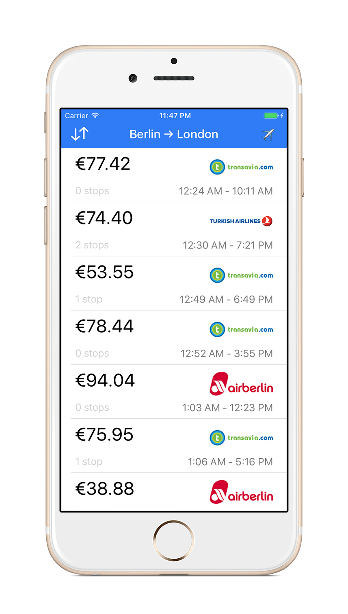

# GoEuro for iOS 

iOS client for [GoEuro](http://www.goeuro.com) service ([requirements](https://github.com/goeuro/iOS-Test)) written in Swift 3

# Requirements
- iOS 10.0 Beta (shoud work on iOS 8 and alter)
- Xcode 8.0
- Swift 3
- Carthage

# Third-party libraries
The app uses [Carthage](https://github.com/Carthage/Carthage) as a dependancy manager. All libs used in the project are listed in [Cartfile](Cartfile).
* [Nuke](https://github.com/kean/Nuke) - Remote Images
* [Unbox](https://github.com/JohnSundell/Unbox) - JSON Mapping
* [Result](https://github.com/antitypical/Result) - Result-oriented Programming

# Setup

* Clone the repo
* `cd` to the project's directory 
* run `$ carthage bootstrap` 

In order to build & run the app on a device, set the Development Team for the following targets:
* GoEuroKit framework
* GoEuro-iOS

# License

Giraffe is available under the MIT license. See the [LICENSE](LICENSE) file for more info.
